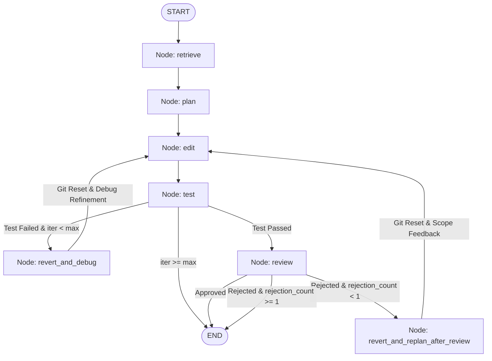

# 🤖 Autonomous Bug-Fixing Agent

An autonomous, multi-persona AI agent that receives natural-language bug reports, retrieves relevant codebase context via AST chunking, plans minimal repairs, executes code edits, runs tests inside isolated Docker containers, retries on failure (bounded), audits changes for scope creep via an independent reviewer, and produces a clean Git pull request diff — **never auto-merging**.

Built with **LangGraph**, **Claude (Anthropic)**, **Tree-Sitter**, **Voyage AI**, **ChromaDB**, **Docker**, **GitPython**, and **FastAPI + React**.

---

## 🏗️ Architecture

```
a:/MiniSoup/
├── config.py                 # Core hyperparameters (MAX_ITERATIONS, image tags, model names)
├── requirements.txt          # Python dependencies
├── start_ui.py               # One-click dashboard launcher
├── agent/
│   ├── state.py              # TypedDict shared state definition
│   ├── retriever.py          # Tree-sitter AST parser + Voyage/Local embeddings + ChromaDB
│   ├── planner.py            # Architect persona: root-cause diagnosis & step-by-step plan
│   ├── executor.py           # Software Engineer persona: surgical code editing
│   ├── sandbox.py            # Isolated Docker container runner (per-test container)
│   ├── reviewer.py           # QA/Security persona: diff audit against plan (detects scope creep)
│   ├── git_ops.py            # Git branching, commits, diffs, resets, PR generation
│   └── orchestrator.py       # LangGraph StateGraph wiring with retry & review loops
├── target_repo/              # Target e-commerce repository with test suites
│   ├── ecommerce/
│   │   ├── auth.py           # Bug 1: JWT & session cookies
│   │   ├── api_client.py     # Bug 2: API client endpoints & headers
│   │   ├── cart.py           # Bug 3: Cart quantity updates (off-by-one)
│   │   └── checkout.py       # Bug 4: Empty checkout handling (null-pointer)
│   └── tests/                # Pytest suites
├── ui/
│   ├── backend.py            # FastAPI + WebSocket streaming server
│   └── frontend/
│       └── index.html        # Modern React 18 live streaming dashboard
└── verify_phase[1-6].py      # Automated verification suites for all 6 phases
```

---

## 🔄 LangGraph StateGraph Workflow



---

## ⚡ Quick Start

### 1. Launch the Live Web Dashboard
```powershell
python start_ui.py
```
Open **[http://localhost:8000](http://localhost:8000)** in your browser.
- Click any of the **4 Seed Demo Bugs** to populate the report.
- Click **"Run Autonomous Fix"** to watch the agent reason, plan, edit, test, and review in real-time over WebSockets!

### 2. Manual CLI Retrieval Query
Sanity-check the AST retriever against the target repository:
```powershell
python -m agent.retriever "JWT auth logic"
python -m agent.retriever "cart quantity update"
```

### 3. Run Automated Phase Verifications
```powershell
python verify_phase1.py   # Git operations & Docker sandbox
python -m agent.retriever # Phase 2 AST retrieval
python verify_phase3.py   # Planner & Executor single-pass
python verify_phase4.py   # LangGraph StateGraph & retry loop
python verify_phase5.py   # Reviewer persona & scope creep rejection
python verify_phase6.py   # FastAPI & WebSocket streaming
```

---

## 🔒 Hard Constraints Enforced

1. **Host Isolation**: Agent-modified code is tested inside isolated Docker containers (or safely mocked if Docker daemon is offline). The host repository is never executed directly.
2. **Zero Auto-Merge**: The agent always outputs a clean unified `git diff` and PR body formatted for human engineering review.
3. **Bounded Iterations**: Governed strictly by `MAX_ITERATIONS` in `config.py` (default: `4`).
4. **Git Revert on Failure**: Working tree changes are reset (`git reset --hard` and `git clean -fd`) before retry attempts so failed edits never compound.
5. **Separate LLM Personas**: Planner, Executor, and Reviewer run with separate system prompts and non-overlapping conversation contexts.
